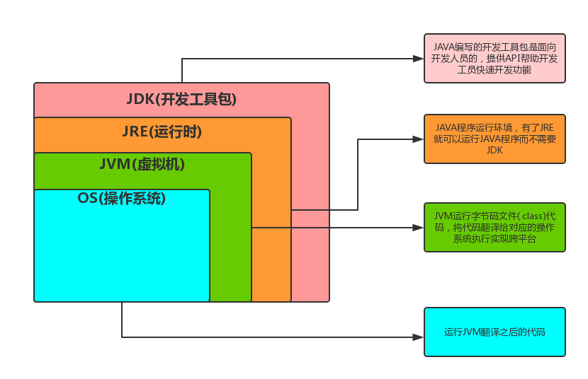

# Chap 01 Java 的基本程序设计结构

## 1.1 JDK、JRE、JVM三者关系



## 1.2 第一个 Java 程序

`FirstExample.java`

```java
public class FirstExample {
    public static void main(String[] args) {
        System.out.println("We wil not use 'Hello World!'");
    }
}
```

* Java 源代码程序 `.java` 后缀作为扩展名

* Java 大小写敏感，类名`FirstExample`与文件名`FirstExample.java`要保持一致

* 在命令行模式中，输入`javac`命令对源代码进行编译，生成包含这个类的字节码文件。

* 编译成功之后，输入`java`命令对class字节码文件进行解释运行。

* ```sh
  $ javac FirstExample.java
  
  $ ls
  FirstExample.class  FirstExample.java
  
  $ java FirstExample
  We wil not use 'Hello World!'
  ```

## 1.3 数据类型

Java 是一种强类型语言，需要为每个变量声明一个类型。

Java 中有八种基本类型：4类整型、2类浮点型、1类字符类型、1类布尔类型。

### 整型

| 类型  | 存储空间 |
| ----- | -------- |
| int   | 4 bytes  |
| short | 2 bytes  |
| long  | 8 bytes  |
| byte  | 1 byte   |

整型范围与运行 Java 代码的机器无关。

### 浮点型

| 类型   | 存储空间 |
| ------ | -------- |
| float  | 4 bytes  |
| double | 8 bytes  |

float 类型的数值后一般有后缀F或者f `3.14F`，没有后缀的浮点数值默认为 double 类型。

### char 类型

char 类型的字面量需要使用单引号括起来。

* `'A'` 编码值为65的字符常量，`"A"` 包含一个字符的字符串

char 类型的值可以表示为十六进制的值，范围是`\u0000 ~ \uFFFF`

Java 中 char 类型描述了采用了 UTF-8 编码的一个代码单元。

### boolean 类型

boolean 类型有两个值：true 和 false